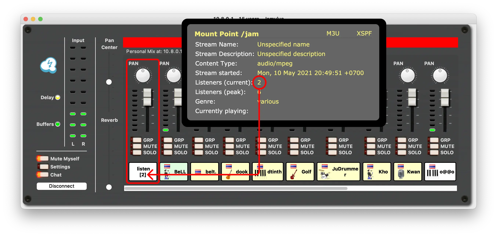

# headless-jamulus-to-icecast-linux-streamer

> **Warning**
> This project is no longer maintained. If you intend to let people listen in to a Jamulus server from a website, consider using [jamulus-lounge](https://github.com/dtinth/jamulus-lounge) instead.

Simple script to stream sound from Jamulus to an Icecast server. Also shows listener count in Jamulus.



## Assumptions
Everything runs on the same machine (accessible from `localhost`).

## Requirements
- Jamulus server running on default port
- Icecast server running on port 8000
- JACK
- Jamulus client compiled from source [with this patch applied](https://github.com/dtinth/jamulus/commit/9f967bbb0f0e56d75f0b21e1b07761c9293a5ab2.patch) with executable located at `../jamulus/Jamulus`
- Ruby 2.5 or later
- ffmpeg

## Prepare `./config.ini`

```xml
<client>
 <language>en</language>
 <name_base64>bGlzdGVuICAgIFsyXQ==</name_base64>
 <instrument>0</instrument>
 <country>0</country>
 <autojitbuf>0</autojitbuf>
 <jitbuf>20</jitbuf>
 <jitbufserver>20</jitbufserver>
 <audiochannels>2</audiochannels>
 <audioquality>2</audioquality>
</client>
```

## Guide

You need 3 terminal tabs (e.g. in tmux)

1. Start a JACK server:

    ```
    jackd --no-realtime -d dummy
    ```

2. Stream to Icecast:

    ```
    echo "icecast://source:<password>@<ip>:<port>/<mountpoint>" > icecast_endpoint
    ffmpeg -f jack -ac 2 -i icecaster -acodec libmp3lame -ab 128k -f mp3 $(cat icecast_endpoint)
    ```

3. Run [the script](check.rb) periodically:

    ```
    while true; do ruby check.rb; sleep 10; done
    ```

    - Streaming will start when there is an active listener AND participant in Jamulus server.
    - Streaming will end when there everyone left the Jamulus server.
